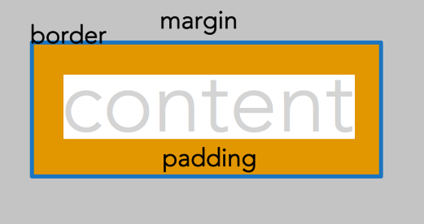

# CSS - Layout



## Box model properties and values

### `border`

- `border-width`
- `border-style`
- `border-color`
- `border-top`

Requires a width, style, and color to display.

Shorthand:

`border: [width] [style] [color]`

`border: 1px solid red;`

```html
<style>
  .border1 {
    border-width: 5px;
    border-style: solid;
    border-color: #c02d28;
  }
</style>

<p class="border1">
  Lorem ipsum dolor sit amet, consectetur adipiscing elit, sed do eiusmod tempor
  incididunt ut labore et dolore magna aliqua.
</p>
```

`Width` values: can be anything you want. Default is 3px.

`Style` values: `solid`, `dotted`, `dashed`, `double`, `groove`, `ridge`, `inset`, `outset`. Also `none`, `hidden`. Without a style, the border will not display.

`Color` values: Any color you want, written in any format you want! Default is black.

### `border-radius`

- border-bottom-left-radius
- border-bottom-right-radius
- border-top-left-radius
- border-top-right-radius

Creates rounded corners. Specify a large radius to make pills or circles.

Size can be the same on 4 sides, or different sizes such as `border-radius: 20px;`. See "shorthand" below for understanding values.

### `padding`

- padding-top
- padding-right
- padding-bottom
- padding-left

Padding is the distance between the content and the border. **Padding values must always be positive.**

See "shorthand" below for understanding values.

### `margin`

- margin-top
- margin-right
- margin-bottom
- margin-left

Margin is the area outside of the border. \*\*Margin values may be positive or negative.

See "shorthand" below for understanding values.

### `width`

The width of a particular element. In general, use relative units like `%`, `em`, `rem`, rather than `px`.

### `height`

The height of a particular element. In general, use of height is to be avoided on content, so it can expand as needed with changes in font size or the type of content.

### `display`

HTML tags have two methods of display by default: `block` and `inline`. Every HTML tag is assigned one of these values.

There are other values for this property including `flex` and `inline-block`.

`display: block;`

`display: flex;`

## Shorthand

Some people think of this as clockwise as well:

4 values

```html
<style>
  p.padding-shorthand2 {
    padding: [top] [right] [bottom] [left];
  }
</style>
```

2 values

```html
<style>
  p.example-shorthand2 {
    padding: [vertical] [horizontal];
    background-color: #d74f25;
  }
</style>
```

1 value

```html
<style>
  p.example-shorthand3 {
    padding: [all sides];
    background-color: #d74f25;
  }
</style>
```

## Box model types

### Content box model

- default
- the width does not include padding and border.

### Border box model

- the width includes padding and border
- You must declare, in your CSS document, that you are working with the border box model.

[Border box model](https://developer.mozilla.org/en-US/docs/Web/CSS/box-sizing)

```html
<style>
  .parent {
    width: 200px;
    box-sizing: border-box;
    border: 5px solid #7c8e88;
  }

  .child {
    box-sizing: content-box;
    /* box-sizing: border-box; */
    border: 10px solid #d74f25;
    padding: 10px;
    width: 100%;
  }
</style>

<section class="parent">
  <p>Parent element</p>
  <section class="child">Child element</section>
</section>
```

The best way to apply a consistent `boder` box model throughout a web page is do use this code as follows:

```
<style>
html {
    box-sizing: border-box;
}
*, *:before, *:after {
    box-sizing: inherit;
}
</style>
```

The first declaration sets the `<html>` tag to the border box model. However, this property is not inherited. The second declaration says for everything in the universe (`*`) and everything before it (`*:before`) and everything after it (`*:after`), inherit the border box model declaration. You can place this at the top of every CSS document you write going forward!

Read more about that formula here: https://www.paulirish.com/2012/box-sizing-border-box-ftw/

## Styling navigation bars in a horizontal and vertical direction

Vertical Navigation Bar

1. Navigation Bar is the unordered list of links
2. Turn off the bullets in the list
3. Style the text in the list
4. Change the links from `display: inline;` to `display: block` so that it stretch as wide as the `<li></li>`
5. Style the link buttons.

Horizontal Navigation Bar

1. Change `<li></li>` from `display: block;` to `display: inline-block;` so that it is in horizontal

## Introducing Flexbox

Flexbox is a new way of managing the layout of responsive web pages.

To make flexbox work, you need two HTML tags that have a parent-child relationship. These are called the _flex container_ (parent) and the _flex item_ (child). Example:

```html
<style>
  div.parent-flex {
    border: 5px solid #7c8e88;
    padding: 10px;
  }
  p.child-flex {
    border: 5px solid #7c8e88;
    padding: 10px;
  }
</style>

<div class="parent-flex">
  <p class="child-flex">
    The paragraph is the child, or flex item, while the div is the parent, or
    flex container.
  </p>
</div>
```

To get started with flexbox, set the display property on the flex container: `display: flex;`

### Flex container properties

`flex-flow` will set up the direction of flexbox and some behaviors. There are two values specified for `flex-flow`. The first is the `flex-direction`. This is typically set to `row` or `column`.

The second value is the `flex-wrap`. This specifies whether the boxes should wrap to another row/column or not. Typical values are `wrap` or `nowrap`.

One other property that might be useful is `justify-content`. Do you want all of the boxes pushed to the beginning of the row (`flex-start`), the end of the row (`flex-end`), centered (`center`), or have any extra space distributed across the row (`space-around`)?

```html
<style>
  div.parent-flex2 {
    display: flex;
    flex-flow: row nowrap;
    justify-content: space-around;
    border: 5px solid #42352c;
  }
  p.child-flex2 {
    border: 5px solid #c02d28;
    background-color: #e7e6d2;
  }
</style>

<div class="parent-flex2">
  <p class="child-flex2">1</p>
  <p class="child-flex2">2</p>
  <p class="child-flex2">3</p>
  <p class="child-flex2">4</p>
  <p class="child-flex2">5</p>
  <p class="child-flex2">6</p>
</div>
```

### Flex item properties

By default in flexbox, if you decide to set up a row of boxes, all boxes will have the same width by default. So if you decide to have a row (a flex container) containing 4 children (or flex items), each child will be 25% wide.

If you don't want to use the default width, then assign the `flex-basis` property to the flex item. This number should be a percentage, if you choose to use it.

```html
<style>
  div.parent-flex3 {
    display: flex;
    flex-flow: row nowrap;
    justify-content: space-around;
    border: 5px solid #42352c;
  }
  p.child-flex3 {
    flex-basis: 10%;
    border: 5px solid #c02d28;
    background-color: #e7e6d2;
  }
</style>

<div class="parent-flex3">
  <p class="child-flex3">1</p>
  <p class="child-flex3">2</p>
  <p class="child-flex3">3</p>
  <p class="child-flex3">4</p>
  <p class="child-flex3">5</p>
  <p class="child-flex3">6</p>
</div>
```

**Why not `width`?**

The `width` property means to make something a certain width -- period! If it's 25%, it will never be 24.99% or 25.01%.

The `flex-basis` property, however, is more flexible. It says to make the width 25%, but a little more or less than that is OK too.

## Introducing Grid

Similar to `flex`, `grid` is one of the most powerful layout system for CSS. It is a 2-dimensional system unlike flexbox (1D).

### Terminology

- Grid Container (Parnet)
- Grid Item (Child)

### Basic Usage

```html
<style>
  div.parent-grid {
    display: grid;
    grid-template-columns: 1fr 1fr 1fr;
  }
  p.child-grid {
  }
</style>

<div class="parent-grid">
  <p class="child-grid">1</p>
  <p class="child-grid">2</p>
  <p class="child-grid">3</p>
  <p class="child-grid">4</p>
  <p class="child-grid">5</p>
  <p class="child-grid">6</p>
</div>
```

This will create a div with 3 columns and 2 rows.

[Learn more about CSS Grid](https://css-tricks.com/snippets/css/complete-guide-grid/)
